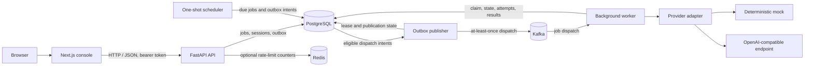

# AetherFlow

### Durable, asynchronous orchestration for AI workloads

AetherFlow is a distributed job-orchestration platform for submitting AI work
through an API, processing it asynchronously, and inspecting its lifecycle in a
web console. It is built as a modular backend with separate worker,
outbox-publisher, and scheduler processes—not as a collection of independently
deployed microservices.

The project focuses on the hard parts around inference: durable job state,
reliable dispatch, retries, ownership boundaries, recovery after process
failure, and clear operational behavior. It does not claim exactly-once
execution, benchmark performance, or production deployment.

[](https://www.python.org/)
[](https://fastapi.tiangolo.com/)
[](https://nextjs.org/)
[](https://www.postgresql.org/)
[](https://kafka.apache.org/)

**Repository:** [amaan-mansoori/AetherFlow](https://github.com/amaan-mansoori/AetherFlow) ·
**Deployment:** no public live deployment is verified; run it locally with Docker Compose.

## What it does

Clients submit bounded structured-inference jobs to a versioned FastAPI API.
The API persists the job and its dispatch intent in PostgreSQL; an independent
publisher sends eligible intents to Kafka, and worker processes claim and
execute jobs. A browser console supports registration, sign-in, job
inspection, and administrative views.

The design makes failure and ownership explicit:

- **Durable lifecycle:** jobs, idempotency records, attempts, results, events,
  and dispatch intents are stored in PostgreSQL and governed by a versioned
  state machine.
- **Reliable dispatch:** a transactional outbox closes the gap between saving
  a job and publishing its message. Leases and bounded retry/backoff allow
  publishers to recover; delivery remains **at least once**.
- **Recoverable execution:** worker claims use leases and compare-and-set
  transitions. Expired work can be recovered, and configured retry policy
  schedules retryable failures without claiming that an interrupted external
  provider call did not happen.
- **Delayed work:** timezone-aware one-shot schedules remain durable in
  PostgreSQL until due; a separate scheduler makes them eligible for normal
  outbox dispatch.
- **Replaceable inference:** a provider boundary isolates job-domain logic
  from provider APIs. The deterministic mock is the default; an
  OpenAI-compatible chat-completions adapter is available through worker
  configuration.
- **Explicit access control:** short-lived bearer tokens and rotating
  HttpOnly refresh cookies support browser sessions. API authorization checks
  current database roles and record ownership. The optional DEMO role can
  inspect only its own seeded examples and cannot perform write or admin
  actions.
- **Operational visibility:** liveness/readiness endpoints and
  Prometheus-compatible application metrics are included. The web console
  provides job, activity, and admin inspection surfaces; it is not a
  monitoring backend.

## Architecture



The API, worker, outbox publisher, and scheduler are separate runtime
entrypoints from the same backend codebase. PostgreSQL is the durable source of
truth; Kafka transports dispatch messages, while Redis is optional,
ephemeral coordination for rate limiting. The scheduler does not publish to
Kafka directly: it makes due jobs eligible through the database/outbox path.

In the outbox flow, the job and dispatch intent are committed together. The
publisher leases an intent, publishes outside the database transaction, and
then records publication. A crash between publication and finalization can
produce a duplicate message; state/version checks make duplicate dispatch
safe to handle, but they cannot prevent duplicate external provider work.
See [Architecture](docs/ARCHITECTURE.md), [Data flow](docs/DATA-FLOW.md), and
[the ADRs](docs/adr/).

## Technology

| Area | Technologies in the implementation |
| --- | --- |
| Frontend | Next.js 16, React 19, TypeScript 5, CSS; Vitest and Testing Library |
| API and domain | Python 3.12+, FastAPI, Pydantic 2 / pydantic-settings, SQLAlchemy 2 async |
| Persistence and migrations | PostgreSQL 16 in Compose, asyncpg, Alembic |
| Dispatch and coordination | Kafka 3.9 (`aiokafka`), Redis 7.4 (`redis` Python client) |
| Inference | Deterministic mock provider; OpenAI-compatible chat-completions adapter using `httpx` |
| Local packaging | Docker, Docker Compose |
| Quality tools | pytest, Ruff, mypy, ESLint, TypeScript compiler |

Dependency ranges and frontend lockfile versions are maintained in
[backend/pyproject.toml](backend/pyproject.toml) and
[frontend/package.json](frontend/package.json). Compose image tags are in
[docker-compose.yml](docker-compose.yml).

## Quick start

The recommended local stack uses Docker Compose for PostgreSQL, Kafka, Redis,
database migrations, the API, worker, outbox publisher, and scheduler. The
frontend runs separately with Node.js.

### Prerequisites

- Git
- Docker Engine with the Docker Compose plugin
- Node.js and npm compatible with the versions in the frontend lockfile
- For backend development and tests outside Docker: Python 3.12 or newer

You do not need to install PostgreSQL, Kafka, or Redis separately for the
Compose workflow.

### 1. Clone and configure

```powershell
git clone https://github.com/amaan-mansoori/AetherFlow.git
Set-Location AetherFlow

if (-not (Test-Path .env)) {
    Copy-Item .env.example .env
}
```

Edit the untracked `.env` and replace `POSTGRES_PASSWORD` and
`AETHERFLOW_JWT_SECRET_KEY` with local, randomly generated values. The JWT
secret must be at least 32 characters. Do not commit `.env`.

### 2. Start the backend stack

```powershell
docker compose up --build -d
docker compose ps
```

Compose applies Alembic migrations before starting the API and background
processes. Check the API:

```powershell
Invoke-RestMethod http://localhost:8000/health/live
Invoke-RestMethod http://localhost:8000/health/ready
```

Open the interactive API documentation at
[http://localhost:8000/docs](http://localhost:8000/docs). The API metrics
endpoint is [http://localhost:8000/metrics](http://localhost:8000/metrics).
Read service logs with `docker compose logs -f api worker outbox-publisher scheduler`.

### 3. Start the console

In a second PowerShell window opened at the repository root:

```powershell
Set-Location frontend

if (-not (Test-Path .env.local)) {
    Copy-Item .env.example .env.local
}

npm ci
npm run dev
```

Open [http://localhost:3000](http://localhost:3000). The frontend example
points to `http://localhost:8000`. Use `localhost` consistently for both
origins so the browser's `SameSite=Strict` refresh cookie remains same-site.
Register a user at `/register`, then sign in. A recruiter demo account is not
created automatically; see [Demo access](#demo-access).

To stop the stack, run `docker compose down`. This preserves the named database
volume. Use `docker compose down -v` only when you intentionally want to delete
local database data.

### Backend development without Compose

The backend test suite uses isolated SQLite databases and fakes for external
services; it does not require the Compose stack. From the repository root:

```powershell
python -m venv .venv
.\.venv\Scripts\Activate.ps1
python -m pip install -e "backend[dev]"
Set-Location backend
pytest tests
```

Running the API or worker manually requires a reachable PostgreSQL database
and appropriate process environment variables. Kafka-backed execution also
requires Kafka, and Redis rate limiting requires Redis. For a complete local
runtime, prefer the Compose workflow above rather than assuming these services
are available.

## Demo access

The recruiter demo is an **opt-in, read-only account**, not a public hosted
demo. A trusted operator must explicitly enable and provision it. It can read
only its own seeded future-scheduled and cancellation-requested examples; the
examples have no dispatch intent and do not represent worker/provider
execution. Demo users cannot submit or cancel jobs, manage API keys, or access
admin routes.

For a fresh local Compose environment:

1. Set `AETHERFLOW_DEMO_ENABLED=true` in the untracked root `.env`.
2. Start the stack with `docker compose up --build -d`.
3. Set `AETHERFLOW_DEMO_PASSWORD` only in a protected operator environment,
   then run:

   ```powershell
   docker compose run --rm --no-deps -e AETHERFLOW_DEMO_PASSWORD api python -m aetherflow.commands.provision_demo
   ```

The provisioning command requires an initial password, hashes it, refuses
identity/role collisions, preserves the password on repeat runs, and creates
the sample fixtures idempotently. Never put the password in a frontend
environment file or commit it. Follow the operator instructions in the
[registration and demo ADR](docs/adr/0024-registration-and-recruiter-demo.md).

## Configuration

The application reads `AETHERFLOW_*` settings from the process environment
and, when run from the directory containing it, `.env`. Compose additionally
requires `POSTGRES_PASSWORD`. The checked-in [`.env.example`](.env.example) and
[frontend/.env.example](frontend/.env.example) contain safe development
templates, not production secrets. Compose sets service-specific values such
as database URLs and internal broker addresses itself.

| Variable | Purpose and requirement |
| --- | --- |
| `POSTGRES_PASSWORD` | Required by Compose for the local PostgreSQL user. Set a private local value. |
| `AETHERFLOW_DATABASE_URL` | Required by the backend when not supplied by Compose; SQLAlchemy async URL for PostgreSQL. |
| `AETHERFLOW_JWT_SECRET_KEY` | Required; at least 32 characters. Use a secret manager or generated secret outside local development. |
| `AETHERFLOW_ENVIRONMENT` | `development`, `test`, or `production`; default `development`. Production requires secure cookies and Kafka enabled. |
| `AETHERFLOW_APPLICATION_NAME` | API title; default `AetherFlow API`. |
| `AETHERFLOW_DEBUG` | FastAPI debug setting; default `false`. |
| `AETHERFLOW_API_HOST`, `AETHERFLOW_API_PORT` | API bind address and port; defaults `127.0.0.1` and `8000`. Compose binds the API to `0.0.0.0:8000` inside its container. |
| `AETHERFLOW_ACCESS_TOKEN_MINUTES`, `AETHERFLOW_REFRESH_TOKEN_DAYS` | Access and refresh lifetimes; defaults 15 minutes and 30 days. |
| `AETHERFLOW_REFRESH_COOKIE_NAME`, `AETHERFLOW_SECURE_COOKIES`, `AETHERFLOW_REFRESH_COOKIE_DOMAIN` | Refresh-cookie name, Secure flag, and optional domain. Secure cookies default off in settings; production settings require them on. Compose enables them. |
| `AETHERFLOW_CORS_ORIGINS` | Exact allowed browser origins as a JSON string array, for example `["http://localhost:3000"]`. Wildcards are rejected. |
| `AETHERFLOW_LOGGING_LEVEL` | Standard Python logging level; default `INFO`. |
| `AETHERFLOW_DEMO_ENABLED` | Enables demo availability when the operator-provisioned account exists; default `false`. |
| `AETHERFLOW_DEMO_PASSWORD` | Operator-only provisioning input, required for first demo-account creation. Not a general application setting; never expose to the frontend. |
| `AETHERFLOW_KAFKA_ENABLED`, `AETHERFLOW_KAFKA_BOOTSTRAP_SERVERS` | Enable Kafka and set broker addresses; defaults `false` and `localhost:9092`. Compose enables Kafka and uses `kafka:9092`. |
| `AETHERFLOW_KAFKA_TOPIC`, `AETHERFLOW_KAFKA_CONSUMER_GROUP`, `AETHERFLOW_KAFKA_CLIENT_ID` | Kafka topic, consumer group, and client ID; defaults `aetherflow.jobs`, `aetherflow-workers`, and `aetherflow`. |
| `AETHERFLOW_KAFKA_AUTO_OFFSET_RESET`, `AETHERFLOW_KAFKA_PRODUCER_ENABLE_IDEMPOTENCE` | Consumer offset policy (`earliest` or `latest`) and producer idempotence; defaults `earliest` and `true`. |
| `AETHERFLOW_WORKER_ID` | Worker identity for execution records; default `aetherflow-worker`. |
| `AETHERFLOW_DATABASE_POOL_SIZE`, `AETHERFLOW_DATABASE_MAX_OVERFLOW`, `AETHERFLOW_DATABASE_POOL_RECYCLE_SECONDS` | SQLAlchemy pool sizing and recycling; defaults `5`, `10`, and `1800` seconds. |
| `AETHERFLOW_OUTBOX_POLL_INTERVAL_SECONDS`, `AETHERFLOW_OUTBOX_BATCH_SIZE`, `AETHERFLOW_OUTBOX_LEASE_SECONDS` | Outbox publisher polling, batch, and lease settings; defaults 1 second, 100, and 60 seconds. |
| `AETHERFLOW_OUTBOX_MAX_ATTEMPTS`, `AETHERFLOW_OUTBOX_INITIAL_BACKOFF_SECONDS`, `AETHERFLOW_OUTBOX_MAX_BACKOFF_SECONDS`, `AETHERFLOW_OUTBOX_PUBLISHER_ID` | Bounded publication retry settings and optional publisher identity; defaults 5 attempts, 1-second initial and 300-second maximum backoff, and no explicit ID. |
| `AETHERFLOW_SCHEDULER_ENABLED`, `AETHERFLOW_SCHEDULER_POLL_INTERVAL_SECONDS`, `AETHERFLOW_SCHEDULER_BATCH_SIZE`, `AETHERFLOW_SCHEDULER_ID` | Scheduler toggle, polling interval, batch size, and identity; defaults `false`, 1 second, 100, and `aetherflow-scheduler`. Compose enables it. |
| `AETHERFLOW_PROVIDER_DEFAULT` | Provider registry selection; default `mock`. |
| `AETHERFLOW_PROVIDER_OPENAI_API_KEY` | Provider secret; required only when the configured default provider is `openai`. Supply through protected runtime configuration. |
| `AETHERFLOW_PROVIDER_OPENAI_BASE_URL`, `AETHERFLOW_PROVIDER_OPENAI_MAX_CONNECTIONS`, `AETHERFLOW_PROVIDER_OPENAI_TIMEOUT_SECONDS` | OpenAI-compatible endpoint and bounded HTTP client settings; defaults `https://api.openai.com/v1`, 10 connections, and 60 seconds. |
| `AETHERFLOW_REDIS_ENABLED`, `AETHERFLOW_REDIS_URL` | Toggle Redis-backed rate limiting and set its URL; defaults `false` and `redis://localhost:6379/0`. Compose enables Redis for the API. |
| `AETHERFLOW_REDIS_MAX_CONNECTIONS`, `AETHERFLOW_REDIS_CONNECT_TIMEOUT_SECONDS`, `AETHERFLOW_REDIS_SOCKET_TIMEOUT_SECONDS` | Redis pool and timeout settings; defaults 10 connections and 1 second for each timeout. |
| `AETHERFLOW_RATE_LIMIT_AUTH_REQUESTS`, `AETHERFLOW_RATE_LIMIT_API_REQUESTS`, `AETHERFLOW_RATE_LIMIT_WINDOW_SECONDS` | Fixed-window request limits and window; defaults 20 auth requests, 120 API requests, and 60 seconds. Limits require Redis and fail open when Redis is unavailable. |
| `NEXT_PUBLIC_API_BASE_URL` | Frontend API origin; set in `frontend/.env.local`, default example `http://localhost:8000`. It is public configuration, not a secret. |

For exact validation ranges and production guards, see
[backend/src/aetherflow/config/settings.py](backend/src/aetherflow/config/settings.py)
and [Compose service configuration](docker-compose.yml).

## API

The API is versioned under `/api/v1`. FastAPI's generated OpenAPI schema at
`/openapi.json` and interactive `/docs` are the authoritative contracts.
Protected requests use a short-lived bearer access token; programmatic clients
can also authenticate with an API key using `X-API-Key` where supported.
Job records are scoped to their owner; ADMIN access is separate.

| Method and path | Purpose and access |
| --- | --- |
| `GET /health/live` | Process liveness; no dependency check. |
| `GET /health/ready` | Readiness check against PostgreSQL; returns `503` if the database is unavailable. |
| `GET /metrics` | Prometheus-compatible process metrics; not included in OpenAPI. |
| `POST /api/v1/auth/register` | Create a standard USER account; does not sign the user in. |
| `POST /api/v1/auth/login` | Authenticate; returns an access token and sets a rotating HttpOnly refresh cookie. |
| `POST /api/v1/auth/refresh`, `POST /api/v1/auth/logout` | Rotate or revoke the refresh session. |
| `GET /api/v1/auth/me`, `GET /api/v1/auth/demo` | Current authenticated user, or demo availability and read-only mode. |
| `POST /api/v1/jobs`, `GET /api/v1/jobs` | Submit a job or list the authenticated user's jobs. |
| `GET /api/v1/jobs/{job_id}` | Read an owned job; another user's job is not disclosed. |
| `GET /api/v1/jobs/{job_id}/attempts`, `GET /api/v1/jobs/{job_id}/events` | Read an owned job's attempts or lifecycle events; optional bounded pagination. |
| `POST /api/v1/jobs/{job_id}/cancel` | Request cancellation, subject to role and state-transition rules. |
| `POST /api/v1/api-keys`, `GET /api/v1/api-keys`, `DELETE /api/v1/api-keys/{key_id}` | Create, list, or revoke the caller's API keys. A newly created secret is returned once. |
| `GET /api/v1/admin/jobs`, `GET /api/v1/admin/jobs/{job_id}`, `POST /api/v1/admin/jobs/{job_id}/cancel` | ADMIN-only bounded inspection and audited cancellation. There is no admin retry/requeue endpoint. |

### Submit a job

For a new job, send `Idempotency-Key` and a bearer token. A successful new
submission returns `201 Created`; an idempotent replay returns the existing
job with `200 OK`. Reusing a key with a different request payload conflicts.

```http
POST /api/v1/jobs
Authorization: Bearer <ACCESS_TOKEN>
Idempotency-Key: <UNIQUE_REQUEST_KEY>
Content-Type: application/json
```

```json
{
  "type": "structured_inference",
  "model": "mock-gpt",
  "input": {
    "prompt": "Analyze the sentiment of: The service was prompt and helpful."
  },
  "configuration": {
    "temperature": 0.2
  },
  "priority": 1,
  "timeout_seconds": 120,
  "retry_policy": {
    "max_attempts": 3,
    "initial_backoff_seconds": 1,
    "max_backoff_seconds": 30,
    "backoff_multiplier": 2,
    "jitter": true
  },
  "metadata": {}
}
```

The create request is validated against the real
[`JobCreateRequest`](backend/src/aetherflow/jobs/schemas.py). To schedule the
job, add a timezone-aware `schedule_at`, for example
`"schedule_at": "2030-01-01T00:00:00Z"`; that illustrative date must still be
in the future when submitted. Future jobs remain `ACCEPTED` without an outbox
dispatch until the scheduler makes them due. Invalid transitions and
idempotency conflicts return a conflict response. Provider credentials are
runtime configuration and are rejected in job configuration.

For authentication payloads, API key semantics, admin filters, and error
envelopes, see [API contract](docs/API.md) and
[API errors](docs/API-ERRORS.md).

## Security and reliability

Implemented controls include:

- Registration accepts email and password only, validates password length,
  hashes credentials with Argon2, and always assigns USER. Role/owner injection
  is rejected. Admin promotion is an operator-only command.
- Refresh credentials are opaque, rotating, HttpOnly cookies with
  `SameSite=Strict`; newly issued access tokens are bound to their refresh
  session family so logout revokes them. Browser Origins supplied to
  login/refresh/logout must match the exact CORS allowlist.
- Authorization resolves current roles from the database. Job access is
  owner-scoped; the DEMO role is denied job writes, API-key mutations, and
  admin routes at the backend boundary.
- API key secrets are high entropy; only a digest is persisted and the secret
  is returned once at creation. Provider credentials are runtime-only and are
  not accepted in job payload configuration.
- Database state changes use explicit transitions and compare-and-set
  protections. Publisher and worker leases enable recovery after process
  failure. Dispatch and provider execution are at least once, not exactly once.
- Redis-backed fixed-window limits are optional outside Compose. On Redis
  failure the implementation intentionally fails open, so those limits are
  not enforced during the outage.

These controls do not make the project production-hardened. Email verification,
account activation, and password recovery are not implemented. Production
still requires HTTPS termination, secure-cookie deployment, protected secret
management, and operational hardening. Do not expose the local Compose stack
as a public service.

## Tests and code quality

Run backend checks from `backend` after installing the `dev` extra. Running
from that directory also keeps a repository-root `.env` out of the test
process's settings lookup:

```powershell
Set-Location backend
python -m pip install -e ".[dev]"
pytest tests
ruff format --check .
ruff check .
mypy src
```

Run the frontend checks from `frontend`:

```powershell
npm test
npm run lint
npm run typecheck
npm run build
```

The backend tests use isolated SQLite databases and fakes for Kafka, Redis,
and provider interactions. They verify domain/API behavior but do not prove
PostgreSQL locking, broker delivery, cross-process Redis limits, or external
provider behavior. The OpenAI-compatible adapter is tested with mock HTTP
transport; live provider credentials are not needed by the test suite.
Compose integration should be tested separately against its real services;
never infer it from the deterministic tests. See the detailed
[testing guide](docs/TESTING.md).

There is no GitHub Actions workflow in the repository at this revision, so
pull-request CI is not configured here. In the current worktree, the full Ruff
format check reports an existing formatting difference in
`src/aetherflow/config/settings.py`; Ruff lint and mypy are separate checks.

## Demo and screenshots

No public application URL or checked-in product screenshots are available at
this revision. Run the app locally using [Quick start](#quick-start); the
recruiter demo requires the separate operator provisioning steps above.

## Status and deferred work

### Implemented

- User registration, login, refresh/logout, API keys, USER/ADMIN/DEMO roles.
- Durable job lifecycle, idempotent submission, transactional outbox, Kafka
  dispatch, worker processing, bounded retry and lease recovery.
- One-shot scheduling, admin inspection/cancellation, provider abstraction,
  deterministic mock, and OpenAI-compatible provider adapter.
- Next.js operations console, health endpoints, process-local metrics, and
  optional Redis-backed rate limiting.

### Known limitations

- Delivery and external inference are at least once; duplicate provider work
  and cost remain possible. There is no exactly-once guarantee or operator
  replay/DLQ workflow.
- Schedules are one-shot; updates use polling rather than streaming.
- Metrics are process-local; there are no bundled dashboards, alerting stack,
  or durable telemetry backend.
- PostgreSQL-specific concurrency and full live Compose behavior require
  separate infrastructure verification. A passing SQLite test is not proof of
  production infrastructure behavior.
- Redis rate limiting fails open when Redis is unavailable. Demo fixtures are
  undispatched examples, not completed inference.
- No production cloud/Kubernetes deployment, backups, HA configuration, or
  performance benchmarks are provided. No performance claims are made.
- Email verification, password recovery, and a public deployment are absent.

### Deferred / candidate improvements

These are not implemented features or delivery commitments: add repeatable
live-service integration checks to CI; build production deployment and secret
management; add account verification/recovery; and evaluate streaming updates,
durable metrics, dashboards, and operational replay/dead-letter workflows.
See [known limitations](docs/KNOWN-LIMITATIONS.md) and the
[architecture decision records](docs/adr/).

## Repository map

```text
.
├── backend/
│   ├── migrations/versions/       # Versioned Alembic schema changes
│   ├── src/aetherflow/
│   │   ├── api/                   # Health, auth, jobs, keys, admin endpoints
│   │   ├── auth/                  # Identity, tokens, authorization policy
│   │   ├── commands/              # Trusted admin/demo provisioning commands
│   │   ├── infrastructure/       # PostgreSQL, Kafka, Redis boundaries
│   │   ├── jobs/                  # Lifecycle, outbox, providers, retry, scheduler
│   │   ├── observability/         # Request IDs, metrics, rate-limit middleware
│   │   └── runtime/               # API, worker, publisher, scheduler entrypoints
│   ├── tests/                     # Backend unit and API tests
│   └── pyproject.toml             # Backend dependencies and tool settings
├── frontend/
│   ├── app/                       # Next.js pages and console routes
│   ├── components/                # Auth, navigation, jobs, and UI components
│   ├── lib/                       # API client and shared frontend logic
│   ├── tests/                     # Vitest component and client tests
│   └── package.json
├── docs/
│   ├── adr/                       # Architecture Decision Records
│   ├── API.md                     # API contract detail
│   ├── TESTING.md                 # Test strategy and verification status
│   └── KNOWN-LIMITATIONS.md       # Operational and product limitations
├── docker-compose.yml             # Local multi-process stack
├── Dockerfile                     # Backend runtime image
└── README.md
```

## Contributing

Issues and focused pull requests are welcome:
[open an issue](https://github.com/amaan-mansoori/AetherFlow/issues) or submit
a pull request against `master`. Before opening a PR:

1. Keep changes scoped and update the relevant API docs or ADR when behavior
   or architecture changes.
2. Run the backend pytest/Ruff checks and frontend test/lint/typecheck commands
   relevant to your changes.
3. For infrastructure-dependent changes, state which services and integration
   checks you actually ran; do not substitute SQLite/fakes for live-service
   claims.
4. Never include `.env`, provider credentials, tokens, or other secrets.

No `LICENSE` or `COPYING` file is present in this repository revision; no
open-source license is asserted here. A license should be added by the project
owner before granting reuse rights.

## Links

- [GitHub repository](https://github.com/amaan-mansoori/AetherFlow)
- [Issues](https://github.com/amaan-mansoori/AetherFlow/issues)
- [API reference](docs/API.md)
- [Architecture and ADRs](docs/ARCHITECTURE.md)
- [Testing guide](docs/TESTING.md)
- [Known limitations](docs/KNOWN-LIMITATIONS.md)
