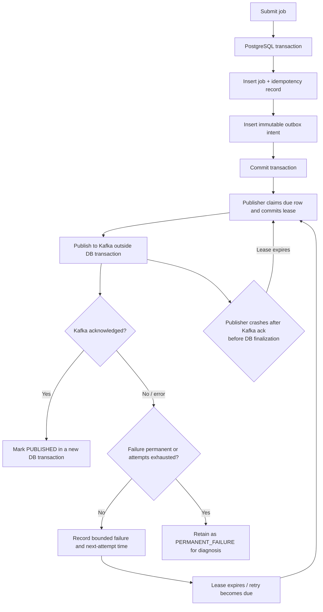
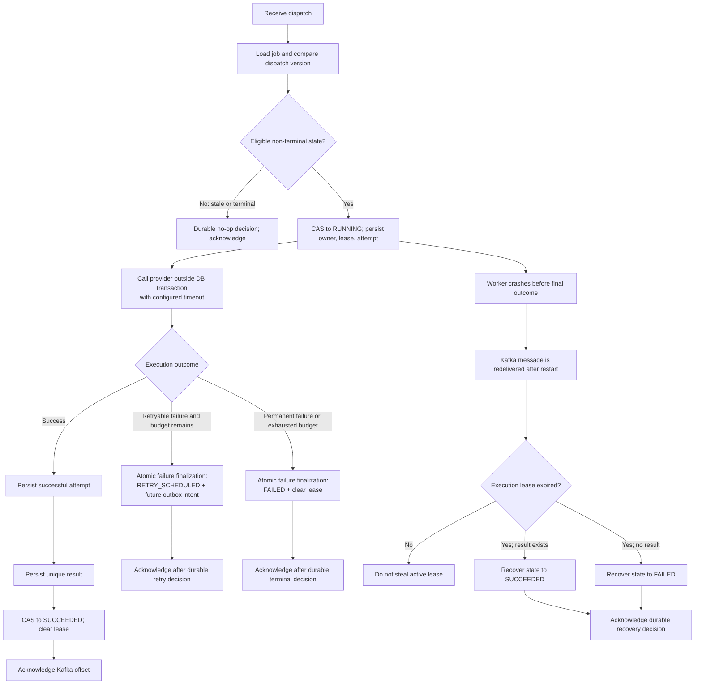
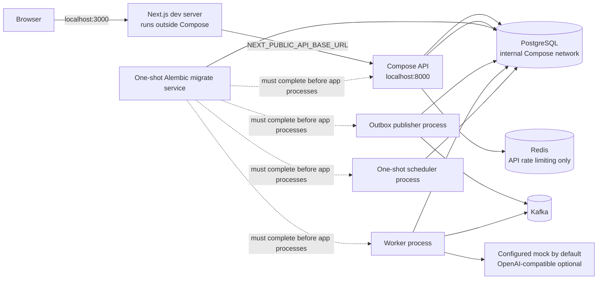

# Runtime and Data Flows

These diagrams describe the current implementation. PostgreSQL is authoritative
for job state. Kafka carries dispatch messages, not job results or a lifecycle
event stream. Redis is used by the API for optional rate limiting; it is not a
job cache or a correctness dependency.

## Job submission through result inspection

```mermaid
sequenceDiagram
    autonumber
    actor Client
    participant API as FastAPI
    participant DB as PostgreSQL
    participant Outbox as Outbox publisher
    participant Kafka
    participant Worker
    participant Provider as Provider adapter
    participant UI as Next.js console

    Client->>API: POST /api/v1/jobs + bearer + Idempotency-Key
    API->>API: Authenticate, authorize, validate payload
    API->>DB: One transaction: job + idempotency record + outbox intent
    DB-->>API: Commit
    API-->>Client: 201 Created (or 200 idempotent replay)
    Outbox->>DB: Lease eligible outbox record
    Outbox->>Kafka: Publish versioned dispatch (job ID key)
    Kafka-->>Outbox: Producer acknowledgement
    Outbox->>DB: Mark published in a separate transaction
    Worker->>Kafka: Consume dispatch
    Worker->>DB: Validate version/state; claim RUNNING + lease + attempt
    Worker->>Provider: Execute outside the database transaction
    Provider-->>Worker: Normalized outcome or classified failure
    Worker->>DB: Persist attempt/result/state transitions
    Worker->>Kafka: Commit offset after durable processing decision
    UI->>API: Poll owned job and history endpoints
    API->>DB: Read current job/result/attempts/events
    DB-->>API: Persisted state
    API-->>UI: Current API response
```

An immediate job is initially `ACCEPTED` with an outbox intent. A future-dated
job remains `ACCEPTED` without an intent until the scheduler activates it.
`GET /api/v1/jobs/{job_id}` is the persisted result/status read path; the UI
does not read Kafka.

## Transactional outbox and publication failure



The crash-after-ack path can publish the same intent again. Kafka producer
idempotence does not create a transaction spanning PostgreSQL and Kafka.
Workers therefore validate the job version and current state; provider calls
can still be repeated. An outbox intent becoming `PERMANENT_FAILURE` has no
operator replay endpoint today.

## Worker execution, retry, and recovery



Execution retry is limited to rate-limit, timeout, and transient-provider
failures. Backoff is capped and deterministic; the accepted `jitter` field is
not currently applied. Other failure categories and exhausted attempts become
terminal `FAILED`. There is no operator retry/requeue API.

The worker persists the successful attempt and result before its final state
transition, in separate commits. If the process crashes between these steps,
lease recovery uses the presence of a result to choose `SUCCEEDED` versus
`FAILED`. Kafka redelivery and provider-side duplicate work remain possible.
The lease is not a provider-side cancellation guarantee.

## One-shot scheduling and cancellation

```mermaid
sequenceDiagram
    autonumber
    actor Client
    participant API as FastAPI
    participant DB as PostgreSQL
    participant Scheduler
    participant Publisher as Outbox publisher
    participant Kafka
    participant Worker

    Client->>API: POST job with timezone-aware future schedule_at
    API->>DB: Commit ACCEPTED job + idempotency record (no outbox)
    API-->>Client: 201 Created, state ACCEPTED
    loop Bounded due-job polling
        Scheduler->>DB: Select due ACCEPTED row with SKIP LOCKED
        Scheduler->>DB: CAS to QUEUED + event + outbox (one transaction)
    end
    Publisher->>DB: Lease due outbox intent
    Publisher->>Kafka: Publish normal dispatch message
    Worker->>Kafka: Consume and execute through worker path

    opt Cancellation before worker claim
        Client->>API: POST /api/v1/jobs/{id}/cancel
        API->>DB: CAS scheduled ACCEPTED to terminal CANCELLED
        Note over Scheduler,DB: Scheduler selects ACCEPTED only; it cannot activate the cancelled job.
    end
```

Schedules are one-shot. A scheduled job still in `ACCEPTED` has not been
claimed for execution, so cancellation transitions it directly to terminal
`CANCELLED`; any already-published message is stale and becomes a worker
no-op. Repeated cancellation is idempotent and the scheduler cannot activate
it. Immediate submissions and scheduled jobs that have moved beyond
`ACCEPTED` use `CANCEL_REQUESTED`: the worker observes that state before
execution, while an active provider call may finish before cancellation takes
effect.

## Authentication and ownership

```mermaid
sequenceDiagram
    autonumber
    actor User
    participant Browser
    participant API as FastAPI
    participant DB as PostgreSQL

    User->>Browser: Register email and password
    Browser->>API: POST /api/v1/auth/register
    API->>DB: Normalize email, hash password, assign USER
    API-->>Browser: Safe user response; no session created
    User->>Browser: Sign in
    Browser->>API: POST /api/v1/auth/login
    API->>DB: Validate credentials; create refresh-session family
    API-->>Browser: Short-lived access token + HttpOnly refresh cookie
    Browser->>API: Protected request with bearer token
    API->>DB: Validate active user/session family; load current roles
    API->>DB: Enforce role and job ownership
    API-->>Browser: Authorized result or common error envelope
    Browser->>API: POST /api/v1/auth/refresh (cookie)
    API->>DB: Rotate refresh token; revoke previous token
    API-->>Browser: New access token + rotated cookie
```

Registration cannot set roles or ownership fields. ADMIN is assigned only by
the trusted operator command. DEMO can read only its own job records and is
denied job submission/cancellation, API-key mutations, and admin endpoints.
Login, refresh, and logout reject a supplied browser Origin not in the exact
configured allowlist. API keys are an alternative credential on supported
protected routes; a request cannot send both API-key and bearer credentials.

## Local Compose topology



Compose publishes the API port; PostgreSQL, Kafka, and Redis communicate over
the Compose network. The frontend is a separate Node.js process. Compose
health checks cover PostgreSQL, Kafka, Redis, and API readiness; worker,
publisher, and scheduler do not have dedicated health endpoints in this
configuration. Use `docker compose ps` and logs for process-level diagnosis,
not as proof of job throughput.
