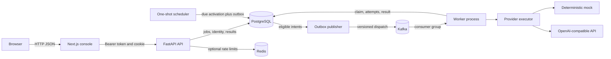
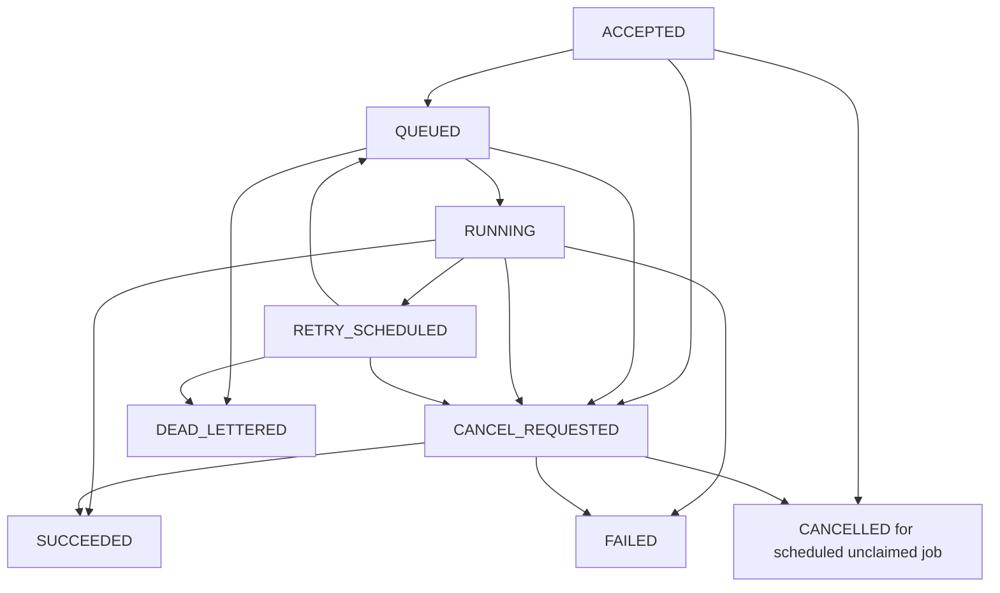

# Chapter 1 — Executive Overview

## What AetherFlow is

AetherFlow is a distributed job-orchestration platform for accepting bounded
AI inference requests, persisting them, dispatching them asynchronously,
executing them through a replaceable provider boundary, and letting an
authenticated user inspect the durable lifecycle in a web console.

**Orchestration** is the control path around the work: validating the request,
assigning an identity and idempotency key, recording intent, choosing when it
may run, handing it to a worker, recording attempts and outcomes, retrying
selected failures, and exposing status. It is deliberately more than calling
an LLM endpoint.

The core persisted entities are users, jobs, idempotency records, attempts,
results, lifecycle events, audit logs, refresh sessions, API keys, and outbox
dispatches. PostgreSQL is authoritative. Kafka transports dispatch messages;
it is not the job database. Redis is optional API rate-limit coordination,
not a job cache, lock authority, or retry store.

## Problem and intended users

An inference request may take much longer than an HTTP request should remain
open. If the API waits synchronously, client timeouts, proxy limits, provider
latency, and caller retries are coupled to execution. A durable asynchronous
system instead acknowledges an accepted request after persistence, executes
independently, and gives the caller a stable job identifier for later
inspection.

The intended users are developers submitting structured inference workloads,
operators inspecting job and dispatch behavior, and engineers studying
reliability boundaries. Example real-world analogues include document
classification, media processing, report generation, and offline enrichment.
Those are examples of the pattern, not additional AetherFlow product features.

## What distinguishes it from CRUD

A CRUD API saves and retrieves records. AetherFlow also has a versioned state
machine, an outbox that couples database state to dispatch intent, an
independent publisher, a Kafka consumer group, worker execution leases,
bounded failure policy, durable retry intents, one-shot scheduling, and
observable attempt/event history. Every boundary introduces a failure window
that must be reasoned about. The project explicitly does **not** claim
exactly-once execution.

## Current capability and boundary

Implemented in the inspected source: authenticated registration and sessions,
API keys, ownership checks, idempotent submission, PostgreSQL persistence,
transactional outbox publication, Kafka dispatch, separate publisher/worker/
scheduler processes, a deterministic mock provider, one OpenAI-compatible
adapter, bounded execution and dispatch retries, expiring worker leases,
one-shot schedules, cancellation, Redis rate limiting, metrics, and a Next.js
console.

Not claimed: a public deployment, production readiness, high availability,
provider-side deduplication, durable metrics, OpenTelemetry/Grafana, a worker
registry, manual retry/replay, recurring schedules, email verification,
password recovery, or performance benchmarks. See
[`docs/KNOWN-LIMITATIONS.md`](../KNOWN-LIMITATIONS.md).

## A 30-second explanation

> AetherFlow is a local-first AI job orchestration project. The API validates
> and persists each job together with an outbox record in PostgreSQL. A
> separate publisher sends versioned dispatch messages to Kafka; workers claim
> them with state/version checks and an execution lease, call a provider
> adapter, and persist the result or a bounded retry decision. The Next.js
> console reads the durable state. Delivery is at least once, so I do not claim
> exactly-once provider execution or production deployment.

Use this as a structure, not a memorized personal story. Replace “I” with
accurate ownership details for your own contribution.

## A 2-minute explanation

> The core problem is that inference can take longer than an API request should
> stay open, and client retries must not accidentally create duplicate jobs.
> Submission therefore validates a strict Pydantic request, authenticates the
> caller, scopes idempotency to that user, and writes a job, idempotency record,
> lifecycle event, and—when due—dispatch intent in one PostgreSQL transaction.
>
> A separate outbox process leases eligible intents, publishes them to Kafka,
> then records publication in another transaction. The unavoidable gap after
> Kafka acknowledges but before PostgreSQL finalization can create duplicate
> messages. The worker consumes with auto-commit disabled and acknowledges only
> after a durable decision. It checks message version and job state, claims
> `RUNNING` with an execution lease and attempt record, then calls a provider
> outside the database transaction.
>
> Success persists a normalized result and terminal state. Selected provider
> failures—rate limits, timeouts, and transient provider errors—can create a
> future outbox intent and `RETRY_SCHEDULED`; other failures or exhausted
> attempts become terminal. A separate database-backed scheduler activates
> one-shot due jobs. The console polls the API; it does not consume Kafka.
>
> This demonstrates practical failure reasoning, but tests use SQLite and
> fakes for most infrastructure boundaries. A limited Compose smoke path was
> observed locally; PostgreSQL concurrency and production operations are not
> proven.

## A 5-minute walkthrough

1. **Start with the invariant.** A job row is the source of truth. API clients
   never set state directly; domain transitions use an allowed transition and
   a version-checked update.
2. **Explain submission.** `POST /api/v1/jobs` accepts an `Idempotency-Key`.
   The request fingerprint includes the normalized request. A repeated key
   with the same fingerprint returns the existing job; a different payload
   conflicts.
3. **Explain the dual-write boundary.** The initial job and outbox intent are
   committed together. Kafka publication is separate, leased, and retriable.
   This avoids losing dispatch intent if the API crashes after commit, but
   permits duplicate publication after Kafka acknowledgement.
4. **Explain worker ownership.** A Kafka message contains a job ID and
   version, not an authoritative copy of job state. The worker reloads the
   row, checks eligibility, records `RUNNING`, lease owner/expiry, and an
   attempt, and calls a normalized executor outside the transaction.
5. **Explain failure.** Only three categories are retried by the current
   execution policy. A retry transition and future outbox row are atomic.
   Crashed executions are not resumed; an expired lease is resolved to
   `SUCCEEDED` if a durable result exists or `FAILED` otherwise.
6. **Explain scheduling and UI.** Future `schedule_at` jobs are activated by
   a bounded PostgreSQL poller. The UI reads status, attempts, events, and
   results through the API and polls while a detail page is active.
7. **Close honestly.** Cite the tests and the limited local smoke verification,
   then state the unverified dimensions: PostgreSQL lock races, broker
   rebalancing, restart recovery at scale, and production deployment.

# Chapter 2 — Problem Statement and Design Goals

## Requirements that motivate the pattern

| Concern | Why it matters | AetherFlow behavior |
|---|---|---|
| Long-running work | Provider execution may outlive an HTTP request budget. | API returns a persisted job; worker executes independently. |
| API responsiveness | The submit path should not hold a client request open for inference. | Submission commits and returns before provider execution. |
| Durable state | A process restart must not erase accepted work or results. | PostgreSQL stores job, attempt, result, event, and dispatch intent. |
| Event delivery | A committed job must eventually become eligible for dispatch. | Transactional outbox plus independent publisher. |
| Failure classes | Some errors may improve with retry; others will not. | `ExecutionFailureKind` and a bounded retry policy. |
| Scheduling | Future execution must survive restarts. | UTC `schedule_at` row and database poller. |
| Crash recovery | A `RUNNING` row cannot remain ambiguous forever. | Expiring execution lease and explicit stale-execution outcome. |
| Visibility | A caller/operator needs evidence of current state and history. | Job, event, attempt, admin, readiness, and metric endpoints. |
| Access control | A user must not inspect another user's jobs. | Database-backed ownership filtering and role dependencies. |

The first column describes general distributed-system motivations. The second
column is grounded in the current implementation. The project does not
implement arbitrary task plugins, recurring schedules, multi-tenant quotas,
operator replays, or horizontal autoscaling policy.

## Goals and non-goals

**Goals:** preserve durable submission; make transport failure recoverable;
bound retry; make state transitions explicit; expose ownership-safe status;
support a credential-free deterministic local demonstration; keep provider
details outside domain state changes.

**Non-goals:** distributed transactions across PostgreSQL and Kafka; exactly
once provider effects; immediate push updates; guaranteed cancellation of
in-flight remote calls; production SLOs; performance claims without a
reproducible benchmark.

## Requirement questions to ask

- What is the job's idempotency scope and retention policy?
- Is the outcome safe to repeat, or does it need provider-side idempotency?
- What is the maximum attempt count and what failures are retryable?
- Does cancellation mean “do not start” or “abort remote work”?
- What is acceptable schedule lateness, and which clock is authoritative?
- What are the data-retention and sensitive-input rules?

Those are product/system decisions, not properties a message broker supplies
automatically.

# Chapter 3 — Complete System Architecture

## Component responsibilities

| Component | Responsibility | Must not become |
|---|---|---|
| Next.js console | Registration/sign-in, job submission/list/detail, admin inspection; calls API. | A source of authorization or job-state truth. |
| FastAPI API | Request validation, authentication, policy dependencies, query/submission services, HTTP error contract. | A synchronous provider runner or direct Kafka publisher. |
| PostgreSQL | Authoritative identity, state, attempts, results, lifecycle/audit records, outbox intents. | A place where the browser writes state directly. |
| Outbox publisher | Lease eligible rows, publish versioned messages, persist publication/failure metadata. | A state-owning worker or API request subroutine. |
| Kafka | Durable asynchronous dispatch transport and consumer-group coordination. | Job/result state storage or proof of provider completion. |
| Worker | Validate message against persisted state, claim execution, call executor, persist outcome, commit offset after durable decision. | A provider-specific business layer. |
| Scheduler | Find due `ACCEPTED` rows and atomically transition/create outbox intent. | A Kafka publisher or in-memory timer registry. |
| Provider adapter | Resolve provider, normalize outcomes and errors; mock or OpenAI-compatible implementation. | A database state-transition service. |
| Redis | Optional fixed-window API rate-limit counters. | A job cache, lock authority, idempotency store, or retry queue. |

Processes are separate entrypoints from a shared Python backend package. This
is a modular monolith with process isolation, not a set of independently
developed microservices.

## System context



## Request and message paths

- **Browser read/write:** Next.js uses `NEXT_PUBLIC_API_BASE_URL`, a bearer
  token held in memory, and credentialed requests for the HttpOnly refresh
  cookie. It polls the API; it does not read Kafka or PostgreSQL.
- **Submission:** API persists the job and idempotency record, and creates
  outbox intent in the same transaction for immediate/past-due work. Future
  jobs wait as `ACCEPTED` until activation.
- **Publication:** publisher commits a short lease, performs Kafka I/O
  outside the database transaction, then finalizes publication in a separate
  transaction.
- **Execution:** worker consumes one record at a time in its loop, processes
  through `Worker`, and commits the Kafka offset after the durable decision.
- **Scheduling:** scheduler changes a due `ACCEPTED` job to `QUEUED`, records
  an activation event, and inserts an outbox row in one transaction.

## Local topology

Compose starts PostgreSQL 16, a single-node Kafka 3.9 KRaft broker, Redis
7.4, one-shot Alembic migration, API, worker, outbox publisher, and scheduler.
The Next.js development server runs outside Compose. Compose health checks
cover PostgreSQL, Kafka, Redis, and API readiness. There are no dedicated
worker/publisher/scheduler health endpoints. This topology is for reproducible
local development, not an HA production design.

## Boundary decisions

PostgreSQL is the source of truth; messages carry a versioned job reference.
The scheduler writes database intent but never publishes directly. Domain
services own transition rules. Provider adapters return normalized
`ExecutionOutcome`/`ExecutionFailure` values. Redis outages bypass limits but
do not affect job correctness. The key diagram and further flow details live
in [`docs/DATA-FLOW.md`](../DATA-FLOW.md).

# Chapter 4 — End-to-End Job Lifecycle

## Submission contract

The route is `POST /api/v1/jobs`; the request model is
`JobCreateRequest` in `backend/src/aetherflow/jobs/schemas.py`. It forbids
unknown fields, bounds type/model/priority/timeout/retry-policy fields,
requires `schedule_at` to be timezone-aware, normalizes it to UTC, and rejects
credential-like configuration keys. `input`, `configuration`, and `metadata`
are dictionaries; that does not make arbitrary tools or code executable.

Example request:

```http
POST /api/v1/jobs
Authorization: Bearer <short-lived-access-token>
Idempotency-Key: interview-demo-001
Content-Type: application/json
```

```json
{
  "type": "structured_inference",
  "model": "mock-model",
  "input": {"prompt": "Classify this short sample."},
  "configuration": {"provider": "mock"},
  "priority": 0,
  "timeout_seconds": 30,
  "retry_policy": {
    "max_attempts": 2,
    "initial_backoff_seconds": 1,
    "max_backoff_seconds": 5,
    "backoff_multiplier": 2,
    "jitter": false
  },
  "metadata": {}
}
```

This is an illustrative shape matching the Pydantic schema, not a captured
response or a promise that every provider accepts every model name. The
mock accepts any non-blank model identifier.

## Step-by-step state/data path

1. **Authenticate and authorize.** The route requires a non-demo authenticated
   user. Authentication loads current user roles; ordinary job lookup is
   owner-scoped unless the user is an authorized administrator.
2. **Validate idempotency.** `validate_idempotency_key` checks the header;
   `submit_job` fingerprints the Pydantic JSON representation and scopes the
   unique record to the principal.
3. **Build durable records.** New `Job` starts at `ACCEPTED`, version 1.
   `JOB_ACCEPTED`, `IdempotencyRecord`, and an initial
   `OutboxDispatch(message_type="JOB_DISPATCH", schema_version="v1")` are
   staged in the same SQLAlchemy session.
4. **Commit.** The API returns HTTP 201 for creation. A matching retry returns
   the saved job with HTTP 200. Reusing a key with different input returns a
   conflict. A unique-index race is handled by reloading the committed record
   and comparing its fingerprint.
5. **Publish.** Outbox publisher lease → Kafka producer `send_and_wait` with
   job UUID key and an `aetherflow.job-dispatch.v1` envelope → separate
   `PUBLISHED` update. Transient publication failure records bounded metadata
   and next-attempt time; invalid records become `PERMANENT_FAILURE`.
6. **Claim.** Worker reloads the job, rejects terminal/stale versions,
   transitions eligible work through `QUEUED` to `RUNNING`, stores an
   execution owner/expiry, and commits an attempt before provider invocation.
7. **Execute.** The provider call runs outside the database transaction under
   `asyncio.wait_for` using the job timeout.
8. **Persist.** A success stores attempt outcome, unique result, clears lease,
   reloads state, and transitions to `SUCCEEDED`. These are separate commits;
   lease recovery uses the presence of a durable result if the process stops
   in between.
9. **Retry or fail.** A retryable failure within budget atomically commits
   attempt metadata, `RUNNING -> RETRY_SCHEDULED`, lease clearing, and a
   future-dated versioned outbox intent. Otherwise it transitions to
   `FAILED`.
10. **Observe.** `GET /api/v1/jobs/{id}`, `/events`, and `/attempts` return
    owner-scoped durable data. Browser detail polling is bounded at a 10
    second interval while visible and stops at terminal state.

## State machine



`FAILED`, `SUCCEEDED`, `CANCELLED`, and `DEAD_LETTERED` are terminal. In the
current local working tree, a scheduled job still `ACCEPTED` is cancelled
directly to `CANCELLED`; an immediate job can use `CANCEL_REQUESTED`. A
pending Kafka message for a now-terminal scheduled job becomes an ineligible
no-op. This behavior is verified by the current cancellation service tests;
older ADR wording predates the current change.

# Chapter 5 — Transactional Outbox Deep Dive

## The dual-write problem

Suppose an API performs two independent writes:

1. Commit a job row to PostgreSQL.
2. Publish a Kafka message.

If it commits first and crashes before publish, a durable job is stranded.
If it publishes first and the database transaction fails, a worker can receive
a job that the API reports as nonexistent. Retrying either operation can also
create duplicates. There is no ordinary local transaction that atomically
commits both PostgreSQL and Kafka.

## AetherFlow's approach and transactions

**T1 — submission transaction:** create `jobs`, `job_events`,
`idempotency_records`, and an initial `outbox_dispatches` row together. Commit.
The row's immutable dispatch fields are job ID/version, schema, and enqueue
time. A future-dated job deliberately has no initial intent until activation.

**T2 — publisher claim transaction:** select one eligible outbox row with
`FOR UPDATE SKIP LOCKED` where supported; write publisher owner, lease
expiry, and increment attempt count. Commit the lease before network I/O.

**Network step:** produce the versioned message to Kafka and wait for
`send_and_wait` acknowledgement using `acks="all"`. Producer idempotence is
enabled by default but configurable.

**T3 — finalize transaction:** update the outbox row to `PUBLISHED`, clear its
lease/error metadata. A publish failure instead records failure category and
backoff or terminal `PERMANENT_FAILURE`.

## Crash timeline

```mermaid
sequenceDiagram
    participant DB as PostgreSQL
    participant P as Publisher
    participant K as Kafka
    P->>DB: Claim row and commit lease
    P->>K: Send message
    K-->>P: Acknowledge
    Note over P: Process crashes before database finalization
    Note over DB: Lease eventually expires; row remains unpublished
    P->>DB: Another poller claims eligible row
    P->>K: Send same dispatch again
    K-->>P: Acknowledge duplicate
    P->>DB: Mark published
```

The finalization failure after a Kafka acknowledgement is the unavoidable
duplicate-publication window. Conversely, failure before Kafka accepts the
message is retriable from the retained outbox row. Lease ownership predicates
prevent one publisher from finalizing another publisher's claim; expiry makes
abandoned claims recoverable.

## Guarantees and non-guarantees

- **Guaranteed by the transaction boundary:** if the job transaction commits,
  the immediate dispatch intent commits with it. A future schedule is durable
  without needing an in-memory timer.
- **Not guaranteed:** one and only one Kafka record; one and only one provider
  invocation; atomic commit across PostgreSQL and Kafka; operator replay of a
  permanent record.
- **Duplicate safety:** the worker compares message job version to persisted
  job version, checks current state, and uses compare-and-set transitions.
  Unique attempt/result constraints protect durable records. They cannot undo
  an already-performed external inference call.
- **Idempotency is separate:** HTTP idempotency prevents duplicate job
  creation for the same principal/key/fingerprint. It is not the same as
  Kafka producer idempotence, consumer offset commits, or provider-side
  idempotency.

Kafka "exactly once" features, when available, cannot extend a transaction
through a third-party LLM call and PostgreSQL result commit. The defendable
description is at-least-once dispatch with state/version-guarded durable
processing and possible repeated external work.

## Operational trade-offs

The outbox adds a table, leases, polling, indexes, bounded retry metadata, and
an operational backlog that must be monitored. In exchange, API latency and
availability are less directly coupled to Kafka. There is currently no UI or
API to replay permanent failures; a production design would need an audited,
version-safe replay policy, retention, and poison-message handling.

**Source references:** `backend/src/aetherflow/jobs/service.py`,
`backend/src/aetherflow/jobs/outbox.py`,
`backend/src/aetherflow/infrastructure/kafka.py`,
`backend/src/aetherflow/infrastructure/database/models.py`,
`backend/tests/test_outbox.py`, ADR-0012 and ADR-0013.
